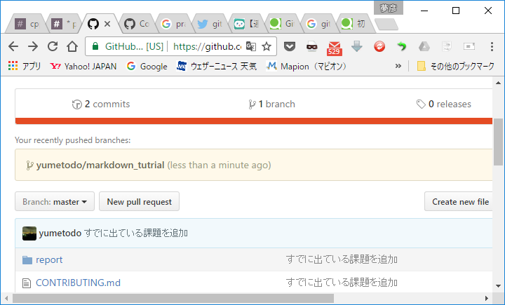
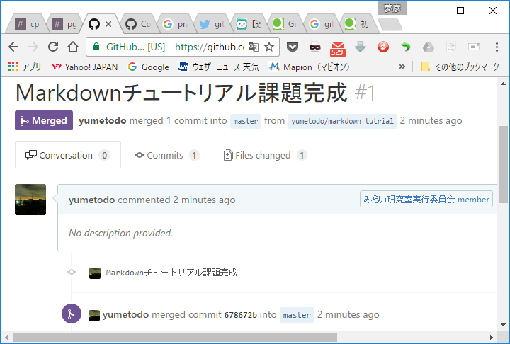

# 全体を通して注意点

- commit メッセージは英語か日本語(無理に英語使う必要はない)
- typo(打ち間違い)の修正は``(typo)``でcommitメッセージを始めること
- そもそもgitがわからない人はこの辺を見るべし  
    - [Learn Git Branching](http://learngitbranching.js.org/)
    - [GitHubで共同開発のためのチュートリアル - Qiita](http://qiita.com/takeokunnn/items/5bc499121a21f8c5b990)
    - [【連載】マンガでわかるGit｜CodeIQ MAGAZINE](https://codeiq.jp/magazine/category/git-ai/)

# 課題提出方法

以下``[name]``はSlackでの名前とする。

1. branchを分ける。branch名は``[name]/[課題名]``にする
2. ``report/[課題名]``の中に``[name]``ディレクトリ(フォルダ)を作る
3. ``report/[課題名]/[name]``に課題で要求されたファイルを置く
4. commit
5. push
6. Pull Requestを投げる。詳細は  
[GitHubで共同開発のためのチュートリアル - Qiita](http://qiita.com/takeokunnn/items/5bc499121a21f8c5b990#6-%E5%A4%89%E6%9B%B4%E3%82%92master%E3%83%96%E3%83%A9%E3%83%B3%E3%83%81%E9%96%8B%E7%99%BA%E4%B8%BB%E8%A6%81%E3%83%96%E3%83%A9%E3%83%B3%E3%83%81%E3%81%AB%E5%8F%8D%E6%98%A0%E3%81%97%E3%81%A6%E3%82%82%E3%82%89%E3%81%86%E3%81%9F%E3%82%81%E3%81%ABpull-request%E3%82%92%E5%87%BA%E3%81%99)  
を参照  

7. mergeされたら提出が認められた。  

# その他typo等のfixを投げる時

適宜投げて構いません。ただし変更が大きいときはきちんとcommitを分割すること
