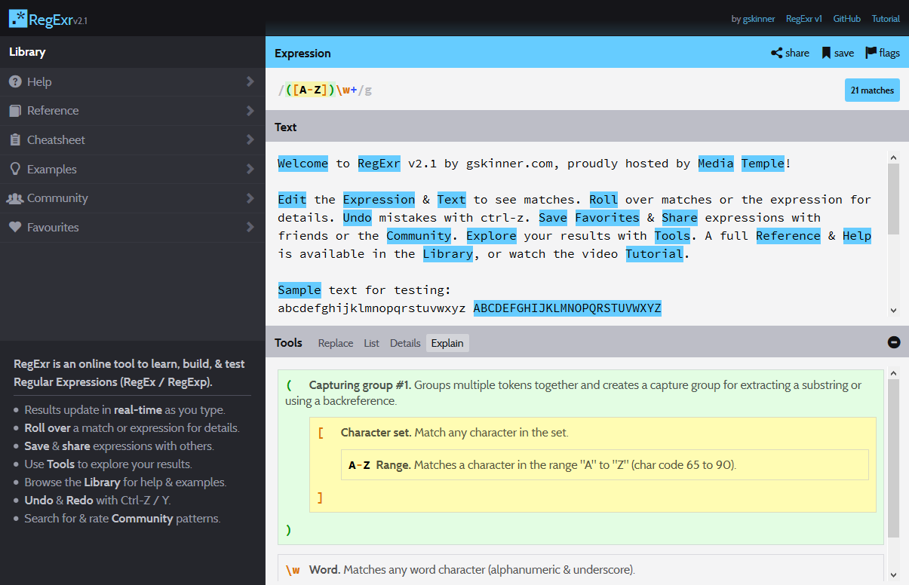
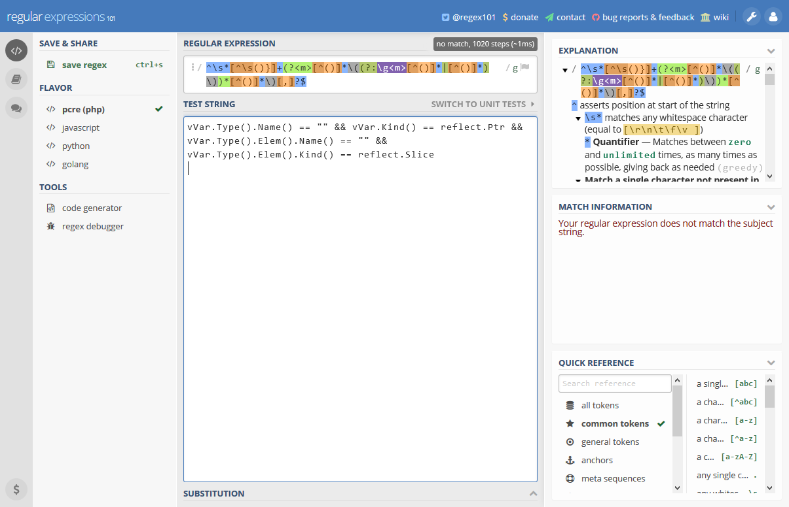

# 正規表現1

## 背景

正規表現は非常に多くの場所で使われ、機械的で退屈なな作業を激減させることができる優れた武器です。

例えばみらいけんでは、イベント終了後のアンケート打ち込み用フォームの入力値の制約を掛ける時や、Webページ作成時に企画名リストを作るのに企画班が作ったExcelのデータをcsvにしてさらに正規表現で変換するのに利用しています。

Markdownがそうだったように正規表現にも方言がありますが、ここではECMAScript(JavaScript)の正規表現文法を参照しましょう。

ECMAScriptの文法はC++11の標準ライブラリでも同じ文法が採用されています。

## 正規表現を書く上でお世話になるサイト

[RegExr: Learn, Build, & Test RegEx](http://www.regexr.com/)



正規表現の説明がマウスをかざすと(英語で)出てくれたり、色分けしてくれたり、地味に下の``List``や``Explain``が便利なのでとりあえず正規表現書くかー、となったら開くサイト。
面倒になってこのサイトに1MBくらいのテキストを投げつけてここで置換処理をやってしまうこともまれによくある。

[Regexper](www.regexper.com)


正規表現を可視化してくれます。文字で説明されてもわからねーよ、ってときに便利です。

[Online regex tester and debugger: PHP, PCRE, Python, Golang and JavaScript](https://regex101.com/)



冒頭で正規表現にはいくつかの方言があると言いましたがこのサイトは今のところ``PHP``/``ECMAScript(JavaScript)``/``python``/``golang``の正規表現に対応しています。興味深いのは正規表現の検索のパフォーマンスを調べられることで、[Atomという有名なテキストエディタのバグ調査にも使われたことがあります](http://postd.cc/how-i-fixed-atom/)。

## 課題

以下の条件を満たす正規表現を書いてください。

### 問題1

電話番号。ただし、電話番号とは10桁もしくは11桁の半角数字とする。

```
９９９８８８７７７７ // => NG
9998887777 // => OK
0Fa1c42349 // => NG
arikitari // => NG
07022223333 // => OK
42861421 //=> NG
999-888-7777 //=> NG
```

### 問題2

人名。ただし名字と名前を区別するために以下のルールにする

``[任意の文字列][全角空白または半角空白のみの文字][任意の文字列]``

```
鈴木　太郎 // => OK
鈴木 太郎 // => OK
田中花子 // => NG
みーくん // => NG
OliverSmith // => NG
Amelia Jones // => OK
Angie // => NG
```

### 問題3

ふりがな。ただし名字と名前を区別するために以下のルールにする

``[ひらがなで構成された文字列][全角空白または半角空白のみの文字][ひらがなで構成された文字列]``

```
鈴木　太郎 // => NG
すずき　たろう // => OK
すずきたろう // => NG
たなか はなこ // => OK
タナカ ハナコ // => NG
ﾀﾅｶ　ﾊﾅｺ // => NG
みーくん // => NG
おりばー すみす // => OK
おりばー・すみす // => NG
アメリア　ジョーンズ // => NG
あんじー // NG
```

## 提出方法

``report/regex1/[name]``に``README.md``を作り回答する
